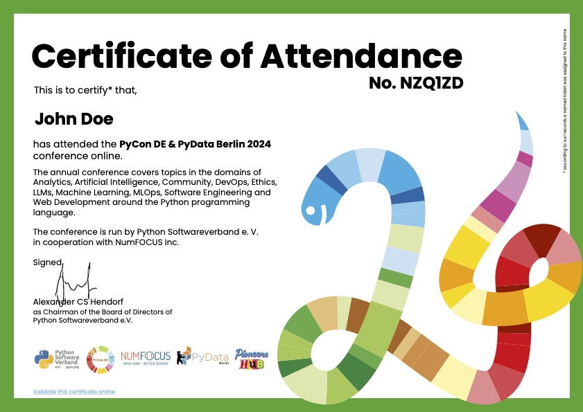
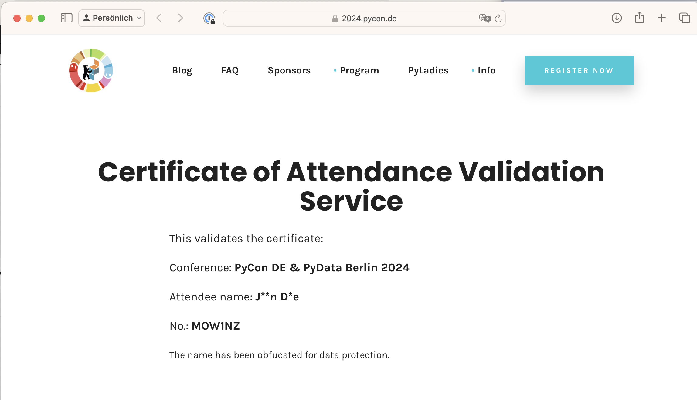

# Design and ship PDF certificates

Issue thousands of signed, secure PDFs and deliver them via branded HTML email — built around the PyCon DE & PyData certificate-of-attendance workflow but useable for any event-driven cert generation.

|                            | What it means                                                                |
|----------------------------|------------------------------------------------------------------------------|
| signed                     | Every PDF is digitally signed with a PKCS#12 keystore and cannot be altered. |
| secure                     | PDF permissions disallow copying text and altering the document.             |
| validated on the website   | A short URL per cert resolves to a public validation page on the event site. |
| branded HTML delivery      | Mailgun-sent emails with inline-CID logo, brand colours, and PDF attached.   |
| idempotent retry           | Re-running the sender skips already-delivered records and retries failures.  |

The pipeline supports three cert types:

- **Attendee** — driven by a CSV; gets a validation page on the website and a delivery email.
- **Masterclass** — driven by an XLSX; delivered only by email.
- **Speaker** — driven by a JSON; one cert per `(speaker, proposal)` pair, delivered only by email.

## Five-step process

1. **Prepare** the source data (see [Walkthrough §3](walkthrough.md#3-data-sources-columns)).
2. **Generate** signed PDFs per cert type (`run.py --type X`).
3. **Publish** attendee validation pages to the website (`validation_upload.py`).
4. **Preview + smoke-test** the emails locally and then to a single test inbox.
5. **Send** for real — Mailgun, branded HTML, PDF attached, persistent retry state.

Each step is independent and can be reviewed before moving on. The complete runbook is the [Walkthrough](walkthrough.md).

Main libraries: [pypdf](https://py-pdf.github.io/) + [reportlab](https://www.reportlab.com/) for cert rendering, [endesive](https://github.com/m32/endesive) for digital signing, [httpx](https://www.python-httpx.org/) for the Mailgun REST client.

## Sample artefacts

Sample PDF certificate:

{: style="width:75%"}

Sample validation page on the event website:

{: style="width:75%"}

## Realization

[Pioneers Hub](https://www.pioneershub.org/en/) helps to build and maintain thriving communities of experts in tech and research to share knowledge, collaborate and innovate together.

{: style="width:50%"}
